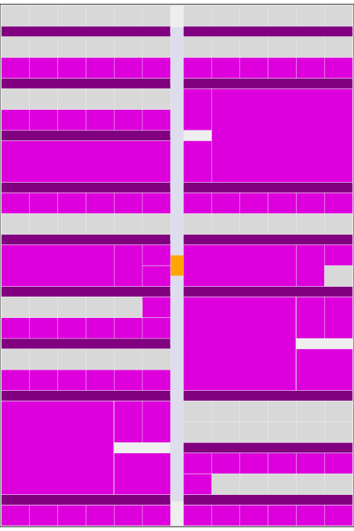
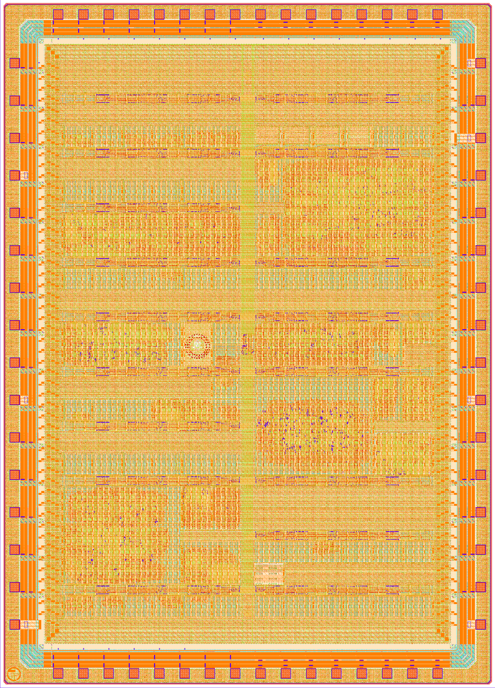
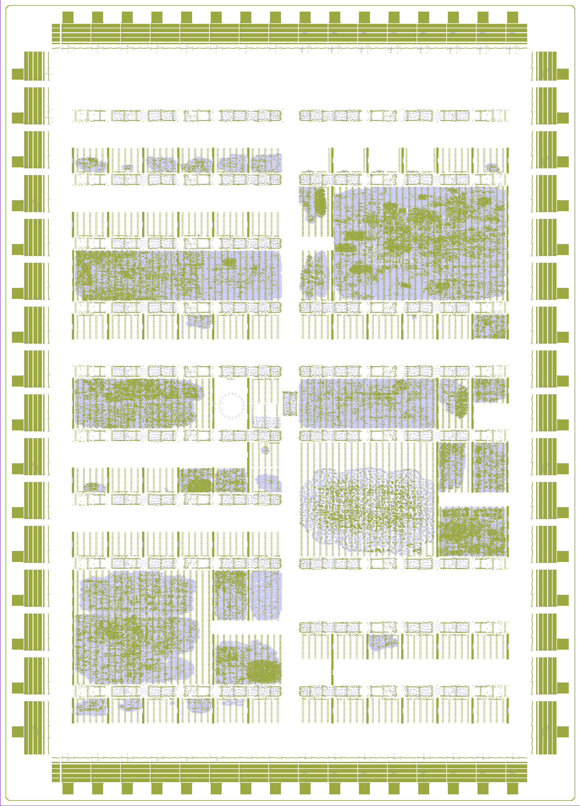

# Chip renders

## Chip layout map

{width=15cm}

```{=latex}
\pagebreak
```

## Full chip render

{width=17cm}

```{=latex}
\pagebreak
```

## Logic density view

{width=17cm}

```{=latex}
\pagebreak
```
